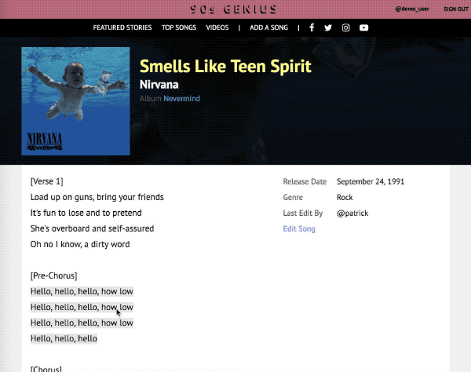
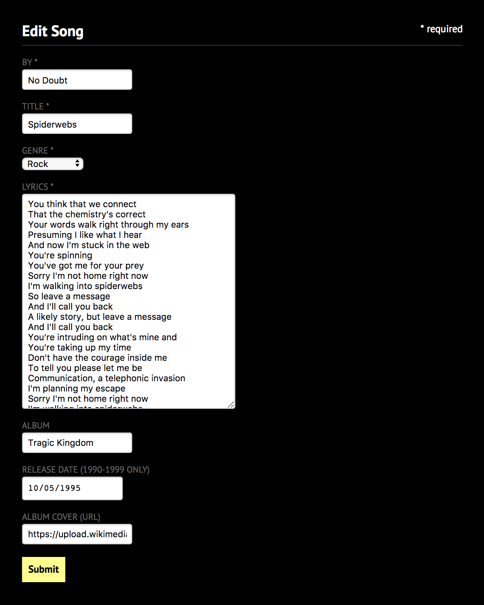

<p align="center">
  
</p>

**Nineties Genius** lets you post about your favorite songs from the best decade in music.

Check it out! [https://nineties-genius.herokuapp.com](https://nineties-genius.herokuapp.com)

#### Run locally
1. make sure Rails and Postgres are installed and that Postgres is running
2. run these commands:
```
bundle install
npm install
bundle exec rails db:setup
rails server
```
3. navigate to http://localhost:3000

***

## Features
* add lyrics, albums and artists
* comment on songs
* annotate verses with trivia and interpretations
* upvote comments and annotations
* read the latest news* (from the 90s)

## Technologies
Nineties Genius is built with Ruby On Rails and a React-Redux frontend. Authentication is handled by BCrypt.

## Annotations
In order to allow users to leave annotations on specific verses from a song, I needed a way to store references to those lyric fragments as well as a way to convert those references into html elements to display to the user.

<p align="center">
  
</p>

I decided to store those fragment strings so I could associate them with annotations. From there I wrote scripts to parse through the plaintext lyrics and insert html tags as needed. Finally I used a library called [html-to-react](https://github.com/aknuds1/html-to-react) to parse through the lyrics again to convert the inserted html tags into actual React components.

```
const addRef = (lyrics, ref) => {
  let fragment = addNewLines(ref.fragment);
  let i = lyrics.indexOf(fragment);
  if (i > -1) {
    let str = `<a ref-id="${ref.id}">${fragment}</a>`;
    lyrics = lyrics.substring(0, i) + str + lyrics.substring(i + fragment.length);
  }
  return lyrics;
};

referents.forEach((ref) => {
  lyrics = addRef(lyrics, ref);
});
```

## Adding Songs
To streamline the process for users adding new tracks to the app, I made it easy to add artist and album information as well as the lyrics when creating a new song.

<p align="center">
  
</p>

In the rails api call, I take any additional album and artist data and search for existing records with that data. If none are found I add those records as well as the new record for the song.

```
@track = Track.new(track_params)

artist = Artist.find_or_create_by(name: params[:track][:artist]) do |a|
  a.author_id = current_user.id
end

if params[:track][:album_title]
  album = Album.find_or_create_by(title: params[:track][:album_title]) do |a|
    a.author_id = current_user.id
    a.artist_id = artist.id
    a.release_date = params[:track][:release_date]
    a.img_url = params[:track][:img_url]
  end
end
```

## Ideas for new features
### Search
This app would definitely benefit from a search feature, it would make finding individual songs and artists much easier.

### Image Uploads
Right now users have to upload hosted image urls which is inconvenient and bad practice from a content management perspective. Users should be able to upload images and have them hosted on the site so there is no reliance on external sites.

### User Profiles
Users can already create their own accounts but it'd be great to have the option to customize their bios and profile pictures.
